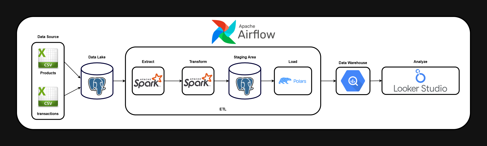
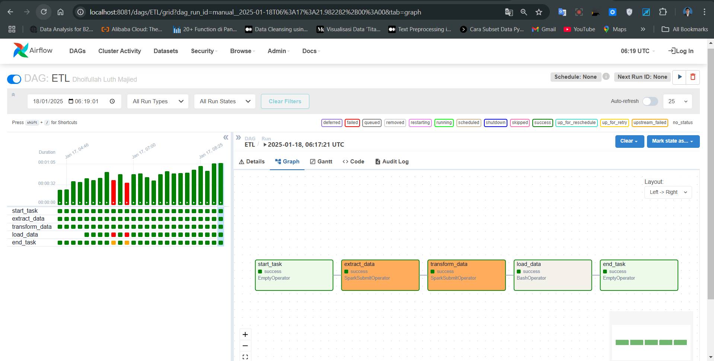
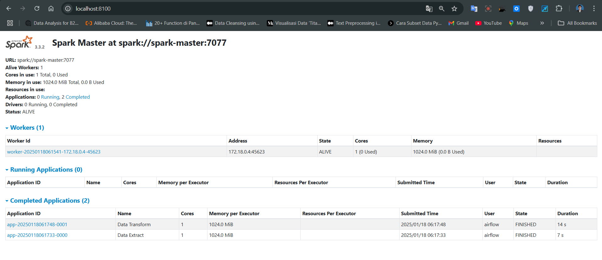
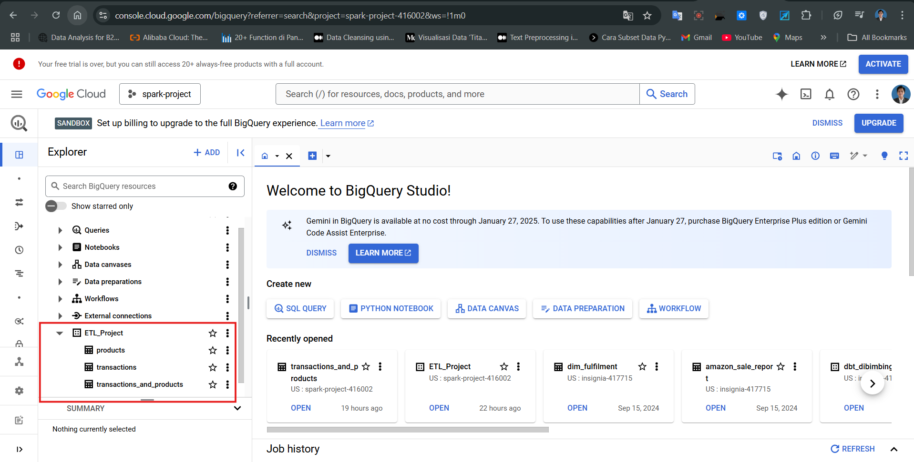
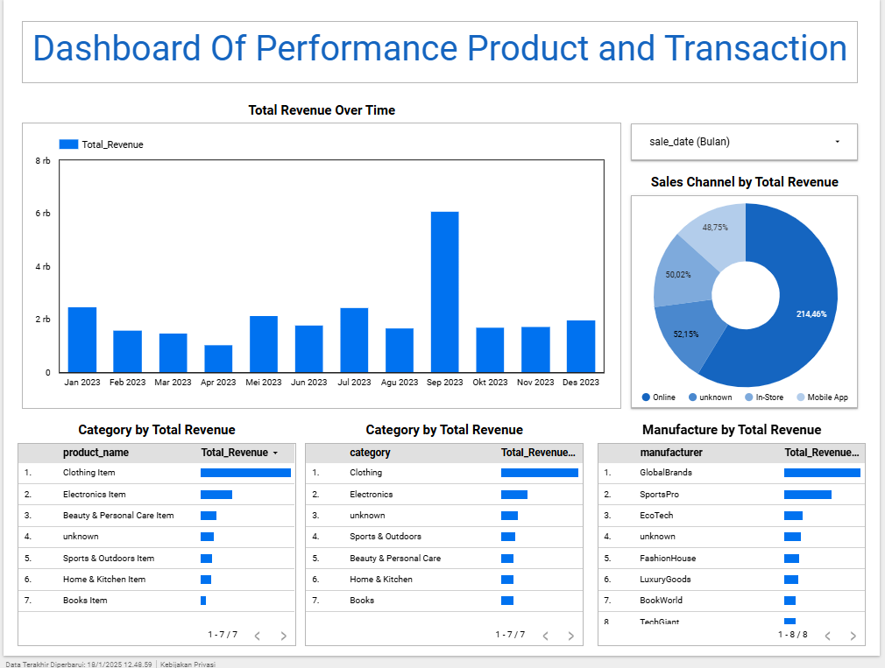

# NTX Data Engineer Technical Assessment Guidelines

Hi, my name is Dhoifullah Luth Majied, I'm interested in the field of data engineering and also have experience in data transformation, ETL, and SQL. I'm very enthusiastic about working on this challenge because this is an amazing opportunity to apply my technical skills in solving complex data problems.

I believe that data has the power to change the way we make decisions, and I am happy to contribute through the solutions I build. If you have any questions or input regarding my solution, I am very open to further discussion.

Thank you for this opportunity! 😊

# Challenge

This repository is an answer I have created based on the given challenge, containing three structured challenge directories:
- **Soal 1** – Data Transformation and Analysis Case
In the answer I gave in the form of a jupyter file or notebooks, please open the notebooks folder or please click this url https://github.com/Ajied21/NTX_DE_Technical_Test/tree/main/notebooks
- **Soal 2** – SQL Case
In the answer I gave in the form of a SQL file and description.txt, please open the sql folder or please click this url https://github.com/Ajied21/NTX_DE_Technical_Test/tree/main/sql
- **Soal 3** – ETL Case
Please follow the `Run Job` command below or you can read it first for some information about the ETL case study.

# ETL Case

- Data Structure 

1. Transaction:

| Column             |
|--------------------|
| **transaction_id** |
| **customer_id**    |
| **product_id**     |
| **sale_date**      |
| **quantity**       |
| **total_price**    |
| **sales_channel**  |

2. Product :

| Column              |
|---------------------|
| **product_id**      |
| **product_name**    |
| **category**        |
| **manufacturer**    |
| **base_price**      |

# A Project Includes The Following Files:

| Project Files                    | Description                                                                                                                      |
|----------------------------------|----------------------------------------------------------------------------------------------------------------------------------|
| **docker compose**               | File used to configure the schedule project, such as using Airflow and PostgreSQL as a database locally.                         |
| **Dockerfile**                   | Text containing the commands needed to create an image for executing ingestions.                                                 |
| **Python**                       | Scripts for executing ingestions, creating DAGs, ETL processes, and using Apache tools like Spark, and Airflow.               |
| **SQL**                          | Scripts for creating databases and reading data from databases like PostgreSQL.                       |
| **Looker Studio Data**           | Used for creating reporting dashboards per batch.                                                                                |
| **Google Cloud Platform (GCP)**  | A cloud computing service by Google to simplify storage, analytics, big data, machine learning, and application development.     |


# Technologies

| Technologies                      | Tools/Technologies                        |
|-----------------------------------|-------------------------------------------|
| **Cloud**                         | Google Cloud Platform (GCP)               |
| **Container**                     | Docker                                    |
| **Workflow orchestration**        | Apache Airflow                            |
| **RDBMS**                         | PostgreSQL                                |
| **Data Warehouse**                | BigQuery                                  |
| **Batch processing**              | Apache Spark and Polars                   |
| **Programming**                   | Python and SQL                            |
| **Visualization Dashboard**       | Looker Studio Data                        |

# Workflow

<div style="text-align: center;">
  
</div>

# Run Job

1. **Clone This Repo** 
2. **Run docker build** :
- `make docker-build`
3. **Run for batch processing** :
- `make spark`
- `make airflow`
- `make postgresql`
- run DAGs in Airflow
* To be able to connect to BigQuery, please create credentials in the service account on GCP with a json file format.
4. **Run for visualization dashboard**
- Open this url : https://lookerstudio.google.com/ and connect to data sources BigQuery then create a report for analyst

# UI Job
- Spark Worker = http://localhost:8100/
- Airflow = http://localhost:8081/

| Command        | Description                                                                              |
|----------------|------------------------------------------------------------------------------------------|
| `docker-build` | Build Docker Images (amd64) including its inter-container network.                       |
| `spark`        | Run a Spark cluster, rebuild the postgres container, then create the destination tables. |
| `airflow`      | Build the orchestrator.                                                                  |
| `postgres`     | Run the database of relationships.                                                       |


# Documentation

- **DAGs on Airflow**
<div style="text-align: center;">
    
</div>

- **Extract and Transform on Spark Worker**
<div style="text-align: center;">
    
</div>

- **Data Warehouse on Bigquery**
<div style="text-align: center;">
    
</div>

- **Dashboard for reports and analyst on Looker Studio**
<div style="text-align: center;">
    
</div>


- Please click the url to visit dashboard
---
```
https://lookerstudio.google.com/reporting/a6ec5678-3b76-4425-812c-570eea770a47
```
